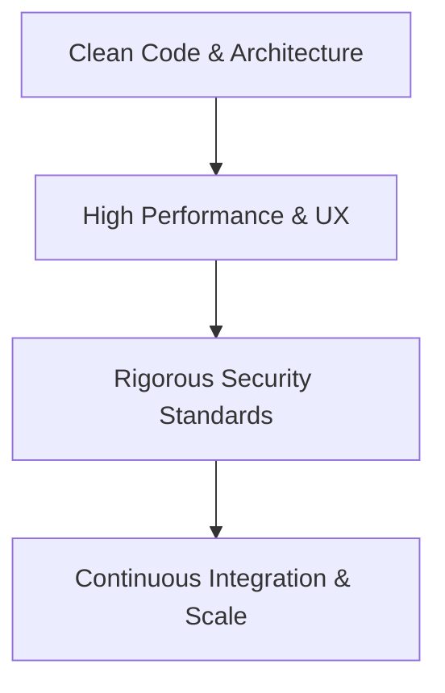

# 🌟 Nguyễn Minh Huy | Senior Full-Stack Developer

  
  
  
  

  

    <strong>Crafting high-performance, robust, and elegant full-stack digital experiences.</strong>
  

---

## 🙋‍♂️ Về Tôi | About Me

### 🇻🇳 Tiếng Việt
Tôi là một **Full-Stack Developer** chuyên thiết kế và triển khai các hệ thống web có khả năng mở rộng (scalable) và hiệu năng cao. Định hướng phát triển của tôi là ưu tiên sự rõ ràng, mạch lạc trong kiến trúc phần mềm — từ cách luồng dữ liệu vận hành ở Backend cho đến sự mượt mà của giao diện người dùng ở Frontend. 

Trong mọi dự án, tôi luôn tập trung vào:
- **Tối ưu hóa hiệu năng**: Đạt điểm số Core Web Vitals tối đa, giảm thiểu độ trễ phản hồi hệ thống.
- **Kiến trúc dữ liệu chặt chẽ**: Thiết kế CSDL quan hệ & phi quan hệ quy mô lớn, tối ưu hóa truy vấn.
- **Tiêu chuẩn bảo mật**: Áp dụng OAuth2, JWT và các tiêu chuẩn bảo mật theo OWASP.
- **Làm việc thực chất**: Chú trọng chất lượng mã nguồn sạch (clean code), khả năng bảo trì và phối hợp nhóm hiệu quả.

---

### 🇬🇧 English
I am a **Full-Stack Developer** dedicated to architecting and building highly scalable, high-performance web applications. My engineering philosophy revolves around clarity and robust design — from streamlined backend data pipelines to polished, interactive frontend experiences.

In every project, I focus on:
- **Performance Optimization**: Achieving near-perfect Core Web Vitals and minimizing server response times.
- **Robust Database Architecture**: Designing highly optimized schemas for both SQL and NoSQL databases.
- **Security Best Practices**: Implementing enterprise-grade authorization and authentication (OAuth2, JWT, OWASP).
- **Clean Code & Team Synergy**: Delivering readable, maintainable code and fostering collaborative engineering cultures.

---

## 🛠️ Năng Lực Kỹ Thuật | Tech Stack

| Layer | Technologies & Tools |
| :--- | :--- |
| **Core Frontend** | `React`, `Next.js`, `TypeScript`, `Tailwind CSS`, `Framer Motion` |
| **Core Backend** | `.NET Core`, `Node.js`, `RESTful API`, `GraphQL` |
| **Real-time & AI** | `SignalR`, `WebSockets`, `AI Agent Integration (RAG)`, `OCR / Multimodal AI` |
| **Database & Caching** | `PostgreSQL`, `MongoDB`, `Redis` |
| **DevOps & Infra** | `Docker`, `AWS Services`, `CI/CD Pipelines`, `Git` |

---

## 🚀 Các Dự Án Tiêu Biểu | Featured Projects

> [!NOTE]  
> *Dưới đây là tóm tắt các giải pháp và công nghệ cốt lõi trong các dự án thực tế tôi đã xây dựng. Nhằm tuân thủ bảo mật thông tin (NDA), các thông tin chi tiết về thương hiệu và dữ liệu nội bộ đã được lược giản.*

### 1️⃣ Real-Time AI-Powered Digital Transformation Platform (F&B Sector)
Hệ sinh thái chuyển đổi số toàn diện cho ngành dịch vụ ẩm thực (F&B) và bán lẻ, kết hợp trải nghiệm người dùng hiện đại và sức mạnh của Trí tuệ Nhân tạo (AI) trong tự động hóa vận hành.

*   **Giải pháp kỹ thuật chính:**
    *   **Real-time Console:** Xây dựng bảng điều khiển quản lý trạng thái thời gian thực với **SignalR/WebSockets**, xử lý luồng dữ liệu song song và thông báo đa kênh thông minh.
    *   **Multi-Agent AI Integration:** Tích hợp các AI Agent hỗ trợ đa ngôn ngữ (RAG) và đa phương tiện (Multimodal), tự động hóa tác vụ trích xuất dữ liệu hóa đơn (OCR), gửi thông báo tự động qua Telegram/Email và giải quyết 60-70% các yêu cầu từ khách hàng.
    *   **High Performance:** Áp dụng Bento UI cao cấp, kết hợp tối ưu hóa hình ảnh động và cơ chế caching giúp hệ thống hoạt động mượt mà, đạt điểm PageSpeed > 90 trên mọi thiết bị.
*   **Công nghệ sử dụng:** `Next.js`, `React`, `SignalR`, `AI RAG / Multimodal`, `Node.js`, `MongoDB`, `Redis`, `Docker`

---

### 2️⃣ Ultra-Performance Bento-Grid Portfolio Hub
Nền tảng hồ sơ năng lực cá nhân trực quan được thiết kế theo cấu trúc Bento Grid hiện đại để tối ưu hóa khả năng truyền tải thông tin đến nhà tuyển dụng.

*   **Giải pháp kỹ thuật chính:**
    *   **Responsive Bento Grid:** Bố cục dạng lưới hiện đại, tự động điều chỉnh hiển thị tối ưu trên các kích thước màn hình khác nhau (từ điện thoại đến màn hình ultra-wide).
    *   **Core Web Vitals tuyệt đối:** Tối ưu hóa SEO và cấu trúc HTML ngữ nghĩa, đạt điểm Lighthouse hoàn hảo (95-100) trên mọi tiêu chí, tốc độ phản hồi dưới 100ms nhờ cơ chế Static Site Generation (SSG).
    *   **Micro-interactions:** Tích hợp các hiệu ứng di chuột (radial spotlight effect) và chuyển động mượt mà bằng **Framer Motion** mang lại cảm giác sống động, cao cấp.
    *   **Lightweight Localization:** Thiết kế hệ thống đa ngôn ngữ (Anh - Việt) tối giản, chuyển đổi trạng thái tức thì không cần tải lại trang.
*   **Công nghệ sử dụng:** `Next.js`, `React`, `TypeScript`, `Tailwind CSS`, `Framer Motion`, `SSG & SEO Optimization`

---

## 🎯 Nguyên Tắc Làm Việc | Engineering Principles

1.  **Viết code cho con người đọc trước, máy chạy sau:** Đề cao tính rõ ràng, cấu trúc thư mục khoa học, dễ bảo trì và dễ mở rộng.
2.  **Trải nghiệm người dùng là số 1:** Không chỉ làm app chạy được, mà phải chạy cực kỳ nhanh và mượt mà.
3.  **Tự động hóa tối đa:** Xây dựng quy trình CI/CD hoàn chỉnh để giảm thiểu lỗi thủ công và tăng tốc độ bàn giao sản phẩm.

---

## 📬 Liên Hệ | Get In Touch

*   **GitHub:** [@Hutt1212](https://github.com/Hutt1212)
*   **Portfolio:** [nguyenminhhuy-portfolio.vercel.app](https://nguyenminhhuy-portfolio.vercel.app/)
*   **Email:** *Vui lòng truy cập trang Portfolio của tôi để gửi thư trực tiếp!*

---

  🚀 <em>Cùng nhau xây dựng những sản phẩm công nghệ tuyệt vời! / Let's build something amazing together!</em>

